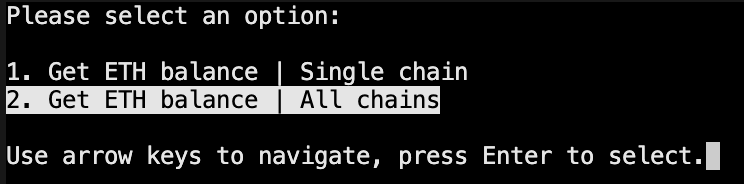
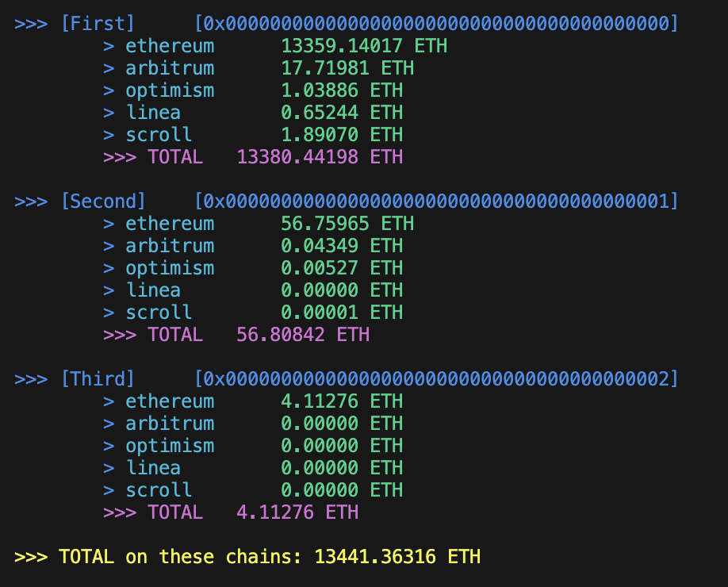

# Onchain Tool
It is a Python tool designed to provide Ethereum and some L2 balances (ETH only yet) for a list of wallet addresses. 

## Features
- Fetch ETH balances for specified wallet addresses.
- Support for multiple Ethereum networks (mainnet).
- Optional ETH token balance fetching.
- Output balance results in the console with optional color coding for clarity.

## Prerequisites
- Python 3.x
- `pipenv` for Python package and environment management
- An internet connection to access Ethereum network nodes

## Installation
1. Clone the Repository
Clone this repository to your local machine using git:
```bash
git clone https://github.com/movet0n/onchain.git
cd onchain
```

2. Setup Python Environment
Use `pipenv` to set up a virtual environment and install the required packages:
```bash
pipenv install
```

3. Set Environment Variables
To ensure the Python scripts run correctly with your project's directory structure, set the PYTHONPATH environment variable:
```bash
export PYTHONPATH="/Path/To/Folder/onchain:$PYTHONPATH"
``` 
_Note: Replace `/Path/To/Folder/onchain` with the path to your project if it differs._

4. Configuration
- Before running the tool, ensure you configure the `config.py` file to include your specific RPC endpoints if needed. 
- Also, one can use either `addresses.txt` or `addresses.json` file to store addresses (no private key is required), see examples in the corresponding files.

## Usage
To run the Onchain Tool, execute the following command:
```bash
pipenv run python3 main.py
```

This will initiate the script, read the addresses from your configured file, connect to the network, and display the balances of each address in the console.



## Output Format
The tool prints the balance for each address, followed by the total summed balance of all addresses checked.

